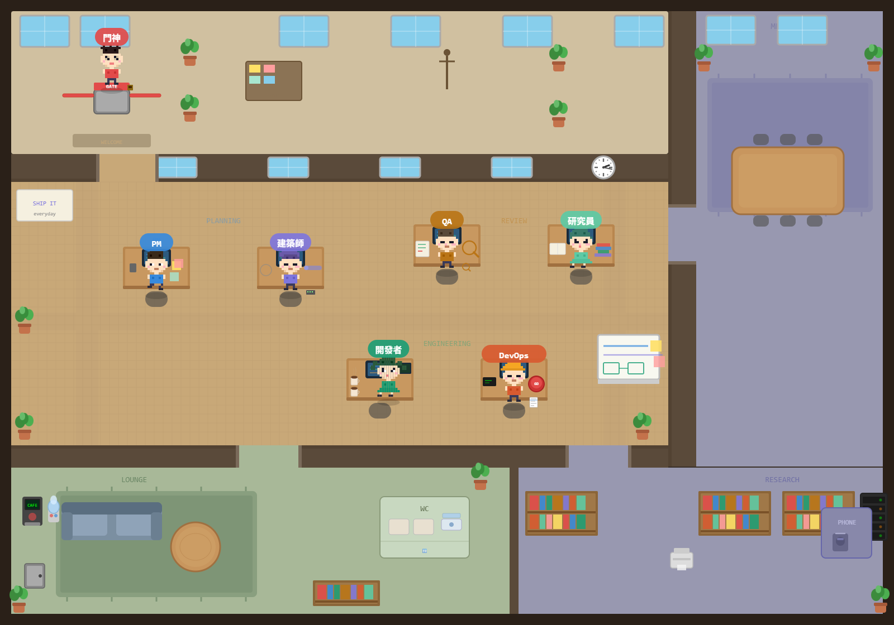

<div align="center">

# Agent Virtual Office

[](LICENSE)
[](https://nodejs.org)
[](https://react.dev)
[](https://vitejs.dev)
[](https://github.com/KbWen/agent-virtual-office/pulls)

**你的 AI Agent 團隊不只是在跑 code — 他們在上班。**



一群像素小人在 2.5D 等距辦公室裡認真工作、偷喝咖啡、吵架、開會、上廁所。
他們不知道你在看，但你看了會嘴角上揚。

*這不是監控面板，是氛圍工具。*

[快速開始](#快速開始) · [狀態 API](#狀態-api) · [English](README.md)

</div>

---

## 他們在幹嘛？

| 小人 | 個性 | 你可能會看到他... |
|------|------|-----------------|
| **PM** | 愛開會、桌上整齊 | 在甘特圖前沈思人生 |
| **建築師** | 戴貝雷帽的哲學家 | 突然衝到白板大喊「有了！」 |
| **開發者** | 雙馬尾、咖啡成癮 | 桌上 5 杯咖啡，還在倒第 6 杯 |
| **QA** | 拿放大鏡的完美主義者 | 跟 Dev 面對面爭論 bug 存不存在 |
| **DevOps** | 戴安全帽的行動派 | 深呼吸，然後按下那個大紅按鈕 |
| **研究員** | 長髮書蟲 | 書堆越疊越高，偶爾恍然大悟 |
| **門神** | 刺蝟頭守門員 | 舉著盾牌說「前置條件不夠」 |

---

## 辦公室日常

每隔 1-3 分鐘，辦公室會隨機發生群體事件：

- **茶歇時間** — 幾個人溜去咖啡機旁聊八卦
- **站立會議** — 全員被 PM 拉到白板前報告進度
- **外送到了** — 有人舉著紙袋進場，全場歡呼
- **打翻咖啡** — 桌上冒驚嘆號，鄰座英勇救援
- **Review 爭論** — Dev 和 QA 的經典三幕劇：「沒 bug！」→「你看這裡」→「好吧修了」
- **部署成功** — Ops 按下按鈕，全場放煙火慶祝
- **靈感時刻** — 建築師突然頓悟，衝去白板畫架構
- **小組會議** — 幾個人走進會議室，開始「嗯嗯同意」

偶爾還會出現稀有事件：有人帶狗來上班、空調壞了全場搧風、老闆巡視所有人假裝認真...

---

## 快速開始

### 方式一：npx（推薦）

```bash
npx agent-virtual-office
```

選項：
```
--port=PORT    埠號（預設 5174）
--lang=LANG    語言：en, zh-TW（預設自動偵測）
--no-open      不要自動開啟瀏覽器
```

### 方式二：Clone & 開發

```bash
git clone https://github.com/KbWen/agent-virtual-office.git
cd agent-virtual-office
npm install
npm run dev
```

打開瀏覽器，看你的小人們上班。就這樣。不需要後端、不需要資料庫、不需要 WebSocket。

---

## 狀態 API

任何工具都能透過 HTTP 推送即時狀態到辦公室：

```bash
# 簡短格式：直接設定角色狀態
curl -X POST http://localhost:5174/api/status \
  -H "Content-Type: application/json" \
  -d '{"dev":"working","qa":"testing","workflow":"Sprint 42"}'

# 完整格式：明確的 agent 列表
curl -X POST http://localhost:5174/api/status \
  -H "Content-Type: application/json" \
  -d '{
    "type": "office-status",
    "agents": [
      {"role":"dev","task":"implement-auth","status":"working","label":"寫認證模組中..."}
    ],
    "workflow": "Build Feature"
  }'
```

### 支援的角色
`pm` · `arch` · `dev` · `qa` · `ops` · `res` · `gate`

### 支援的狀態
`idle` · `working` · `blocked` · `done`

### 平台整合

| 平台 | 整合方式 |
|------|---------|
| **Claude Code** | 從 hooks 或腳本 `curl POST` |
| **Gemini CLI** | 從 shell hooks `curl POST` |
| **Codex CLI** | 從 task runner `curl POST` |
| **任何 CI/CD** | 從 pipeline 步驟 `curl POST` |
| **瀏覽器** | `postMessage` 或 `BroadcastChannel('agent-office')` |

---

## 嵌入模式

```
http://localhost:5174?mode=panel    # IDE 側邊欄用的精簡面板
http://localhost:5174?lang=zh-TW   # 強制中文
```

---

## 多語系

預設語言為英文，可切換繁體中文：

- URL 參數：`?lang=zh-TW`
- 應用內切換：控制面板的 EN/中 按鈕
- CLI 旗標：`--lang=zh-TW`
- 自動偵測：瀏覽器語言為 `zh-TW` / `zh-Hant` 時自動使用中文

---

## 技術亮點

| 特色 | 細節 |
|------|------|
| **純 SVG 像素藝術** | 16×20 像素格手繪角色，7 種髮型 + 7 種表情 + 2 種性別 |
| **25 種行為動畫圖標** | 每個行為旁邊都有對應的小圖標（鍵盤、咖啡杯、放大鏡...） |
| **RAF 移動系統** | requestAnimationFrame 驅動的 80px/s 平滑走路 |
| **走廊路由** | 角色走路會經過門口和走廊，不會穿牆穿桌 |
| **行為引擎** | 權重隨機系統：工作 65% / 日常 12% / 社交 13% / 離席 10% |
| **狀態感知對話** | working 時說「衝衝衝!」，blocked 時說「救命啊」 |
| **真實時間連動** | 中午趴桌午休、晚上只剩 Dev 和一盞燈 |
| **永不卡死** | try/catch + 看門狗計時器，行為排程鏈永遠不會斷 |

---

## 設計哲學

> 好的體驗：Dev 小人在打字，旁邊放著一杯冒煙的咖啡，QA 走過來拍他肩膀遞了一張紙。
>
> 壞的體驗：Dev 小人頭上寫著「/implement 進度 67%」。

先做好玩的，再做有用的。

---

## 文件

- [技術架構](docs/ARCHITECTURE.md) — 系統架構、移動系統、行為引擎內部細節
- [設計規格書](docs/DESIGN_SPEC.md) — 視覺風格、精靈系統、動畫狀態、事件腳本
- [精靈圖需求](docs/SPRITE_REQUIREMENTS.md) — 像素藝術素材規格

---

## License

MIT

---

<div align="center">

**[English](README.md)** · **[中文](README.zh-TW.md)**

用像素和咖啡做的。

</div>
