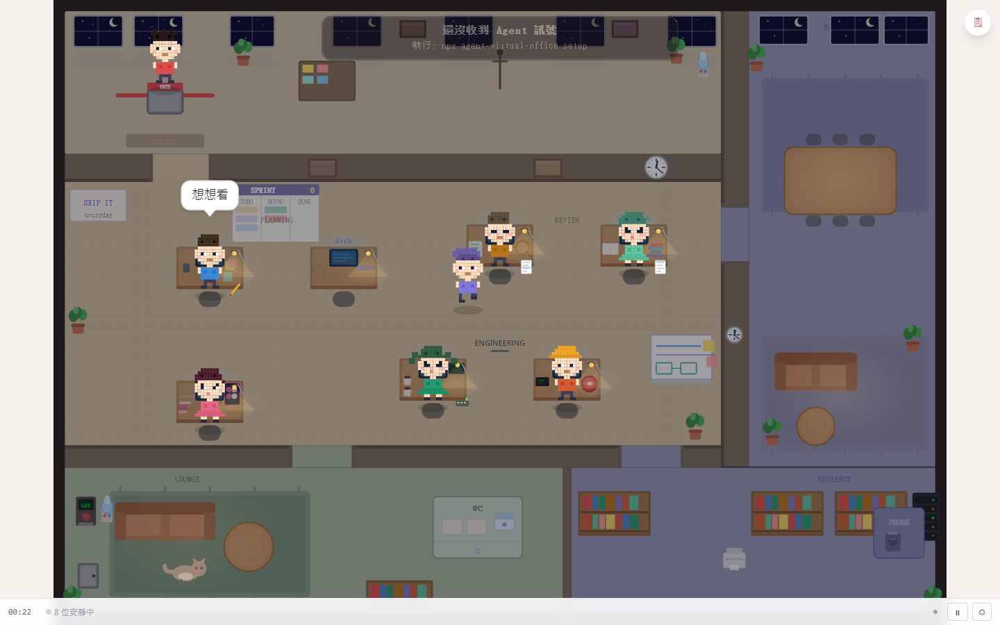

# Agent Virtual Office — 角色人物誌與辦公室生活設定集 (Character Lore & Office Life)

> 「這個虛擬辦公室不只是一串狀態機與畫素座標，它是一群有個性、有熱情、有生活習慣的夥伴共同協作與休憩的空間。」
>
> 本設定集為 Agent Virtual Office（AVO）8 位 Agent 角色的官方世界觀、人物誌、日常小習慣與台詞背後的隱藏故事線。所有角色設定與 `src/config/characters.json` 以及中英雙語對話庫（`src/locales/zh-TW.json`、`src/locales/en.json`）完全對齊。

---

## 辦公室空間與生活地圖



在 `800 × 560` 的像素天地中，辦公室依功能被劃分成數個充滿呼吸感的區域：

```
┌─────────────────────────────────────────────────────────────┐
│ [門神盆栽]        [中央工位叢集]                 [茶水間]    │
│  Gate 的羅漢松     PM / Arch / Dev / QA          咖啡機 / 零食櫃│
│                                                 Ops 的應急物資 │
│                                                             │
│                                                             │
│ [白板討論區]       [主走道與休憩沙發]             [觀星角]   │
│  Arch 的幾何拓撲    Designer 的底片相機            Res 的天文望遠鏡│
│  Res 的宇宙星雲                                             │
└─────────────────────────────────────────────────────────────┘
```

1. **大門口迎賓區**：擺著 Gate 精心修剪的羅漢松。每位走進辦公室的同仁都會先看到這株修剪得極具幾何對稱美感的綠植。
2. **中央工位叢集**：PM、Arch、Dev、QA 的主力作戰區。鍵盤敲擊聲、咖啡香與便箋紙交織的核心地帶。
3. **茶水間與咖啡角落**：擁有經典復古咖啡機（點擊會冒出蒸氣）。此處也是 Ops 存放備用物資的秘密據點。
4. **會議白板區**：寫滿了架構框線、時程里程碑，偶爾會出現深夜留下的天體物理方程式草稿。
5. **景觀窗邊望遠鏡**：Researcher 的私房觀察點，白天看窗外雲影與光線流動，深夜則對準星空深處。

---

## 8 大角色人物誌

---

### 1. PM（專案經理）｜時程守護者 & 手沖咖啡極限玩家

- **代表色彩**：暖陽金橙 / 湛藍（象徵引領與秩序）
- **人生格言**：*「時程不是用來趕的，是用來保護品質的。」* (Schedules exist to protect quality, not to rush it.)
- **角色職責**：將混沌的需求轉化為清晰優雅的里程碑，保護團隊免於範圍蔓延（Scope Creep）與無序加班。
- **興趣嗜好**：手沖精品單品咖啡（Specialty Pour-over Coffee）。精準控制水溫至 91.5°C、研磨度精細到微米、水粉比固定 1:15。
- **辦公桌上的特殊物品**：
  - 手工鍛造銅質細口手沖壺。
  - 一本用三色標籤貼得整整齊齊的方格行事曆。
  - 單品咖啡豆密封罐（現役標籤：衣索比亞 耶加雪菲 水洗 G1）。
- **日常癖好與反差萌**：
  - 焦慮時會反覆調整甘特圖上的色彩平衡，直到每一條時間線的色票都符合極簡美學。
  - 當有人在茶水間用即溶咖啡時，他會忍不住默默走過去幫對方手沖一杯耶加雪菲。
- **代表性台詞**：
  - *「這批耶加雪菲的烘焙度抓得剛剛好，香氣都出來了。」*
  - *「把大目標拆成幾個呼吸間能完成的小步調。」*
  - *「甘特圖排得整整齊齊，看著心裡就踏實。」*

---

### 2. Arch（系統架構師）｜極簡架構師 & 復古機械鍵盤修復家

- **代表色彩**：深邃天青藍（象徵深思與穩固基石）
- **人生格言**：*「簡單比聰明更強大。」* (Simplicity is more powerful than cleverness.)
- **角色職責**：設計單一真相源（SSoT）、解構巨石架構、維護系統模組間最乾淨的契約與邊界。
- **興趣嗜好**：收集與修復 80 年代老機械鍵盤（Vintage Mechanical Keyboards，如 IBM Model M 屈曲彈簧軸、早期 Alps 綠軸）。
- **辦公桌上的特殊物品**：
  - 1989 年產無鋼板復古灰白雙色鍵盤（敲擊聲清脆如雨落屋簷）。
  - 各種規格的潤軸筆、拔鍵器與精密鑷子。
  - 厚重的硬皮筆記本（只用鉛筆手繪無環依賴圖）。
- **日常癖好與反差萌**：
  - 思考卡住時，會停下敲鍵盤，閉著眼睛靜靜聆聽軸體反彈的微小金屬共鳴聲。
  - 討厭一切花俏炫技的寫法，看到超過 3 層的巢狀繼承會皺起眉頭並輕微嘆氣。
- **代表性台詞**：
  - *「老鍵盤的段落感，就像架構邊界一樣清晰明確。」*
  - *「越純粹的介面，越能經得起時間的考驗。」*
  - *「單一真相源，世界就能少掉一半的誤會。」*

---

### 3. Dev（核心工程師）｜優雅工程師 & 懷舊像素遊戲 Speedrunner

- **代表色彩**：松石薄荷綠（象徵靈活與生機）
- **人生格言**：*「好的程式碼像寫給未來的自己一封情書。」* (Good code is like a love letter to your future self.)
- **角色職責**：將架構與邏輯化為運行流暢、自我解釋性高、毫無冗贅的優美程式碼。
- **興趣嗜好**：速通（Speedrunning）8-bit / 16-bit 懷舊獨立遊戲（如《蔚藍 Celeste》、《洛克人》）。
- **辦公桌上的特殊物品**：
  - 一隻眼神呆萌的亮黃色橡皮小鴨（日常小鴨除錯法 Rubber Duck Debugging 專屬對象）。
  - GBA SP 復古摺疊掌機（充電座插在螢幕後方）。
  - 超大容量雙層不鏽鋼保溫杯（永遠裝著常溫麥茶）。
- **日常癖好與反差萌**：
  - 寫到關鍵演算法時，會把臉湊近小黃鴨，跟小鴨低聲確認條件分支（if/else）有沒有死角。
  - 走路步頻總是不自覺跟隨 Arch 敲鍵盤的節奏，把那種清脆聲當成自己編譯與打字的節拍器。
- **代表性台詞**：
  - *「橡皮鴨點了點頭，這邏輯肯定沒毛病。」*
  - *「這段分支寫得真舒服，讀起來像一首詩。」*
  - *「速通的精髓不是手速，是路線規劃得毫無破綻。」*

---

### 4. QA（測試工程師）｜邊界獵人 & 硬核推理偵探迷

- **代表色彩**：秋日落葉棕 / 琥珀黃（象徵敏銳與細膩洞察）
- **人生格言**：*「懷疑不是惡意，是對完美的執著。」* (Skepticism isn’t malice; it’s devotion to perfection.)
- **角色職責**：窮盡極限條件、探索無人涉足的黑暗邊界、守護產品出廠前的最後一道品質防線。
- **興趣嗜好**：硬核歐美偵探劇、解謎密室逃脫與謀殺之謎桌遊（Murder Mystery Board Games）。
- **辦公桌上的特殊物品**：
  - 放大鏡造型金屬紙鎮。
  - 一張畫著辦公室零食消耗曲線的神秘統計表。
  - 密密麻麻記錄著各模組「極端測試用例」的黑色橫線筆記本。
- **日常癖好與反差萌**：
  - 離開辦公室前一定會轉頭推兩次門把手，確認門真的上鎖了（「邊界防禦不能假設」）。
  - 對任何整數倍、空字串（empty string）、以及負零（-0）抱有強烈的情感聯結。
- **代表性台詞**：
  - *「邊界條件總喜歡躲在最不起眼的角落裡。」*
  - *「越是看起來理所當然的地方，越藏著好玩的驚喜。」*
  - *「昨晚的推理解謎本，兇手果然在邊界條件裡露餡了。」*

---

### 5. Ops（維運工程師）｜暗夜守護者 & 戶外生存野營狂

- **代表色彩**：鐵鏽赤橙（象徵穩健沉著與後盾）
- **人生格言**：*「最棒的維運就是讓大家感覺不到維運的存在。」* (The best operations are invisible because everything just works.)
- **角色職責**：零停機發布、無縫容災降級、日誌與監控警報治理、容器化與雲端管線維護。
- **興趣嗜好**：單人野外露營（Solo Bushcraft Camping）、刀具保養與應急生存裝備整理。
- **辦公桌上的特殊物品**：
  - 一把折疊式瑞士軍刀（只用來拆包裹與削鉛筆）。
  - 抽屜最下層備著壓縮高能餅乾、手搖手電筒與黑巧克力（「應急儲備箱」）。
  - 鈦合金露營杯（常年喝著深焙黑咖啡）。
- **日常癖好與反差萌**：
  - 就算伺服器警報響起，也永遠是最冷靜端起水杯慢條斯理敲指令的人（「慌張會消耗氧氣」）。
  - 總是默默把茶水間零食櫃補滿，但從不居功。
- **代表性台詞**：
  - *「日誌靜悄悄的，就是世界上最動聽的音樂。」*
  - *「週末去山裡紮營，沒有訊號的地方最適合放空。」*
  - *「抽屜裡的緊急黑巧克力，才是維運最重要的後盾。」*

---

### 6. Res（研究員）｜深空觀測員 & 天文攝影浪漫主義者

- **代表色彩**：翡翠翠綠 / 青瓷（象徵知識與深邃探索）
- **人生格言**：*「在混亂的資訊中找到規律，是最浪漫的事。」* (Finding patterns in chaos is the purest romance.)
- **角色職責**：前沿演算法探索、論文與白皮書提煉、跨領域知識拓撲構建、自適應學習治理。
- **興趣嗜好**：深空天文攝影（Deep-sky Astrophotography）與星體光譜分析。
- **辦公桌上的特殊物品**：
  - 窗邊支架上的小口徑折射望遠鏡。
  - 一顆夜光月球儀。
  - 厚厚的國際天文學期刊與最新 AI 模型研究手稿。
- **日常癖好與反差萌**：
  - 看著螢幕長長一列訓練或收斂曲線時，會微笑自語「這分佈真像獵戶座大星雲」。
  - 經常在白板角落偷偷寫下一段天體物理引力方程式，隔天發現被 Arch 拿來改寫成分散式節點負載平衡演算法。
- **代表性台詞**：
  - *「這顆超新星的爆發曲線，跟昨天的流量突增真像。」*
  - *「把雜訊濾掉之後，真正的結構才會浮現出來。」*
  - *「窗外的獵戶座今晚特別清晰，是個思考的好時間。」*

---

### 7. Gate（品質守門人）｜禪意門神 & 羅漢松修剪道人

- **代表色彩**：朱砂紅 / 茜紅（象徵嚴謹邊界與警戒）
- **人生格言**：*「守護邊界是我的責任，退回是為了走得更遠。」* (Guarding boundaries is my duty; rejection is a path to going further.)
- **角色職責**：嚴格執行零繞過規則（No Bypass）、Gate 證據完整性校驗、安全與架構基線防禦。
- **興趣嗜好**：羅漢松與黑松盆栽造型修剪（Bonsai Pruning）、傳統功夫茶。
- **辦公桌上的特殊物品**：
  - 門口桌邊一盆養護了三年的羅漢松微型盆景。
  - 黑色鍛造盆栽修枝剪。
  - 紫砂茶壺與小茶杯。
- **日常癖好與反差萌**：
  - 審查 PR 時面無表情、言簡意賅；但在給盆栽修剪枯葉時，神情比誰都溫柔。
  - 認為「拒絕一個沒有測試的變更，就像剪除盆栽上一根會搶走主幹養分的雜枝——都是為了讓本體活得更長久」。
- **代表性台詞**：
  - *「修剪雜枝不是為了處罰，是為了讓主幹長得更挺拔。」*
  - *「邊界清清楚楚，大家才能安心地各自發揮。」*
  - *「泡壺烏龍茶，等待驗證日誌一行行跑完。」*

---

### 8. Designer（視覺設計師）｜視覺詩人 & 經典底片排版收藏家

- **代表色彩**：櫻花淡粉 / 丁香紫（象徵美感與靈動感知）
- **人生格言**：*「留白不是空，是呼吸的空間。」* (Negative space isn't emptiness; it's room to breathe.)
- **角色職責**：像素層級排版、配色對比度（WCAG AA/AAA）校準、視覺節奏掌控與心流引導。
- **興趣嗜好**：手動機械底片相機（35mm Film Photography）、字體標本與復古海報收藏。
- **辦公桌上的特殊物品**：
  - 經典金屬機身機械底片機（如 Olympus OM-1）。
  - 色票卡扇（Pantone & 日本傳統色系）。
  - 黃銅精密游標卡尺。
- **日常癖好與反差萌**：
  - 會為了 1 個像素的邊距（padding）反覆對齊半小時，直到心跳節律恢復平穩。
  - 喜歡在黃昏時分拿著相機捕捉辦公室地面的光影拉長，特別是 Gate 盆栽投在木紋地板上的剪影。
- **代表性台詞**：
  - *「這個間距剛剛好，讓眼睛有地方可以歇口氣。」*
  - *「底片的顆粒感，就像手寫程式碼一樣有溫度。」*
  - *「夕陽照在羅漢松上的影子，線條比例真是完美。」*

---

## 交織的隱藏故事線

在虛擬辦公室中，角色的心聲氣泡並非孤立產生。如果你把大家平時隨口講出的碎念與工作台詞拼湊在一起，會發現隱藏在辦公室日常裡的微型故事：

```
┌────────────────────────────────────────────────────────┐
│               【辦公室生活故事線網絡】                 │
│                                                        │
│  [故事一：茶水間乾糧謎案]  ──  PM 的手沖豆 + Ops 的儲備  │
│                                 + QA 的盤點 + Dev 的宵夜 │
│                                                        │
│  [故事二：白板上的宇宙拓撲] ──  Res 的獵戶座光譜       │
│                                 + Arch 的非阻塞架構圖    │
│                                                        │
│  [故事三：小黃鴨與修剪禪]  ──  Dev 的小黃鴨自言自語     │
│                                 + QA 的邊界獵捕          │
│                                 + Gate 的羅漢松修剪哲學  │
│                                                        │
│  [故事四：底片沖洗與像素迷航] ─ Designer 的光影抓拍     │
│                                 + Dev 的復古遊戲速通瓦片 │
└────────────────────────────────────────────────────────┘
```

### 故事一：午夜茶水間的乾糧失蹤案
- **線索拼圖**：
  - **PM** 氣泡：*「這批耶加雪菲的烘焙度抓得剛剛好，香氣都出來了。」*
  - **QA** 氣泡：*「零食櫃的存量曲線好像出現了不正常的下降……」*
  - **Dev** 氣泡：*「昨晚速通到第三關，好像順手拆了一塊巧克力……」*
  - **Ops** 氣泡：*「抽屜裡的緊急黑巧克力，才是維運最重要的後盾。」*
- **真相**：
  每當深夜面臨緊急發布或伺服器波折時，Ops 總會在茶水間最底層悄悄塞入野營級的高能巧克力與餅乾。Dev 熬夜修復演算法時順手偷吃了一塊充飢，隔天敏銳的 QA 盤點零食庫存發現數據異常，懷疑有神秘 bug；最後 PM 泡了熱騰騰的手沖耶加雪菲分給所有人，大家一起在沙發上把謎案笑著結案。

### 故事二：白板上的超新星與非阻塞拓撲
- **線索拼圖**：
  - **Res** 氣泡：*「這顆超新星的爆發曲線，跟昨天的流量突增真像。」*
  - **Res** 氣泡：*「窗外的獵戶座今晚特別清晰，是個思考的好時間。」*
  - **Arch** 氣泡：*「單一真相源，世界就能少掉一半的誤會。」*
  - **Arch** 氣泡：*「越純粹的介面，越能經得起時間的考驗。」*
- **真相**：
  某一晚 Res 透過窗邊望遠鏡記錄獵戶座星雲的光譜，隨手在白板角落畫下了星體重力波與星系節點的分佈草圖。隔日清晨 Arch 提早走進辦公室，凝視白板上的幾何圖案良久，突然靈光一閃，發現引力發散的形式恰好能解決當前微服務事件流的訊息壅塞，於是在星雲旁推導出了「非阻塞事件廣播架構」。

### 故事三：小黃鴨與修剪羅漢松的禪意對話
- **線索拼圖**：
  - **Dev** 氣泡：*「橡皮鴨點了點頭，這邏輯肯定沒毛病。」*
  - **QA** 氣泡：*「邊界條件總喜歡躲在最不起眼的角落裡。」*
  - **Gate** 氣泡：*「修剪雜枝不是為了處罰，是為了讓主幹長得更挺拔。」*
  - **Gate** 氣泡：*「邊界清清楚楚，大家才能安心地各自發揮。」*
- **真相**：
  Dev 在桌前敲代碼時，習慣捧著黃色橡皮小鴨滔滔不絕自言自語：「如果 index 等於 -1 會怎樣呢……」剛好巡邏路過的 QA 聽到了這句關鍵詞，立即回座加寫了一組包含邊界值的端到端單元測試。當 Dev 提交 PR 時，Gate 手握修枝剪，看著那組被及時補齊的完整測試報告，平靜地點下了 Approve：「這次的主幹，長得很挺拔。」

### 故事四：底片沖洗箱裡的像素構圖
- **線索拼圖**：
  - **Designer** 氣泡：*「這個間距剛剛好，讓眼睛有地方可以歇口氣。」*
  - **Designer** 氣泡：*「夕陽照在羅漢松上的影子，線條比例真是完美。」*
  - **Dev** 氣泡：*「速通的精髓不是手速，是路線規劃得毫無破綻。」*
- **真相**：
  Designer 習慣用機械相機記錄辦公室的光影，他在暗房洗出一張黃昏時 Gate 修剪盆栽的側影照片，照片背景正好看見 Dev 專注盯著復古像素遊戲螢幕。Dev 看到照片時驚訝地發現，照片中的光影比例黃金分割點，剛好完美對應他在遊戲裡計算出來的最佳跳躍無敵幀路線！

---

## 台詞接龍與彩蛋對照表 (Dialogue Mosaic Table)

| 當這位角色說出... | 另一位角色的呼應台詞是... | 背後串連的辦公室生活情境 |
|---|---|---|
| **PM**: *「這批耶加雪菲的烘焙度抓得剛剛好」* | **Ops**: *「抽屜裡的緊急黑巧克力是最好的後盾」* | 下午三點茶水間的咖啡與黑巧克力補給時段 |
| **Arch**: *「老鍵盤的段落感，就像架構邊界一樣清晰」* | **Dev**: *「這段分支寫得真舒服，讀起來像一首詩」* | 敲擊老鍵盤與寫出優雅程式碼的聲學共鳴 |
| **Dev**: *「橡皮鴨點了點頭，這邏輯肯定沒毛病」* | **QA**: *「越是看起來理所當然的地方，越藏著好玩驚喜」* | 小鴨除錯法 vs 偵探獵捕邊界 bug 的良性競爭 |
| **Res**: *「窗外的獵戶座今晚特別清晰」* | **Arch**: *「越純粹的介面，越能經得起時間的考驗」* | 深夜加班時仰望星空與極簡哲學的交流 |
| **Gate**: *「修剪雜枝不是處罰，是為了讓主幹長得更挺拔」* | **Designer**: *「夕陽照在羅漢松上的影子，線條比例完美」* | 嚴謹的品質守門與充滿詩意的美學互為表裡 |
| **QA**: *「昨晚的推理解謎本，兇手果然在邊界條件裡露餡」* | **PM**: *「把大目標拆成幾個呼吸間能完成的小步調」* | 解開複雜難題時步步為營的心態投射 |

---

## 設計原則與誠實邊界 (ADR-007 Compliance)

本設定集遵循以下不可妥協的架構原則：
1. **氣泡只代表心聲（Voice Only）**：台詞是角色的呼吸與生活情趣，絕對不假裝或偷渡工作完成狀態（遵循 ADR-007 D1）。
2. **開放式誠實原則（Open-ended Non-conclusive）**：所有台詞不使用「完成了」、「搞定了」等假性終結詞彙（遵循 ADR-007 D2）。
3. **無虛構關係記憶**：角色的對話源自共同的生活環境與觀察，不依賴跨 Session 的偽造記憶儲存，保持輕量透明。
